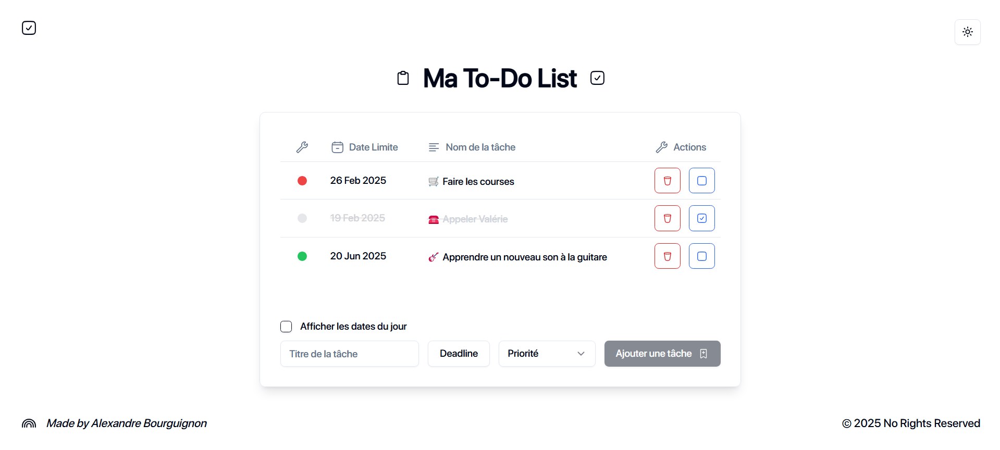

# 🗒️Ma To-Do List

## React + TypeScript + Vite
___


__A little React-TypeScript-Vite-Shadcn/ui project that reproduce a to-do list behavior.__
In which you can :
- ➕ <strong>Create tasks</strong> with title, deadline and priority level
- ✅ Mark as <strong>completed</strong> via interactive visual indicator
- ✏️ Dynamically <strong>Update</strong> title, deadline or priority level
- 🗑️ Permanently <strong>Delete</strong> a task from the list


## ✨ Special Features
___

- 💾 Tasks are saved in your navigator cache, so that you never lose your tasks unless you clear your navigator cache
- 🌟 Developped with [shadcn/ui](https://ui.shadcn.com/) components and [MynaUI](https://mynaui.com/icons) to render a simple and modern UI


## 📦 Installation
___
```bash
    $ cd path/to/you/projects/rep
    $ git clone git@github.com:alexandrebrgn/react-todolist.git
    $ cd path/to/your/project
    $ pnpm i
```

## 🚀 Usage
___

```bash
    $ pnpm run dev
```


## 🔗 Deployed project Link
___

Thanks to Vercel, you can see this little project deployed online

- [👀 See what it looks like](https://react-todolist-ywxu.vercel.app/)
## 📄 Project architecture
___

This project features a <strong><em>modular folder structure</em></strong> designed to enhance maintainability and testability. 
Key components are logically separated
```
📂 to_do_list
├── 📂 public
│   └── 📁 fonts
├── 📂 src
│   ├── 📂 components
│   │   ├── 📁 components
│   │   └── 📁 ui (shadcn/ui)
│   ├── 📁 context
│   ├── 📁 helpers
│   ├── 📁 hooks
│   ├── 📁 styles
│   ├── 📁 types
│   ├── 📁 utils
│   ├── 📄 App.tsx
│   ├── 📄 main.tsx
├── 📄 .gitignore
├── 📄 package.json
└── 📄 other config files
```


